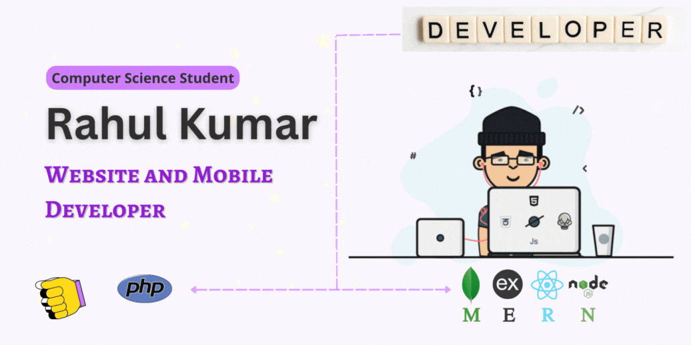

## Hi, I'm Rahul kumar 👋 [here](https://rkpassin132.github.io/)

``` A passionate Backend Developer ```

[](#)

I am a B.tech (Computer science engineer) student and a Website & Mobile app developer. I have experience in front-end developemnt using ``HTML/CSS, JavaScript, React, React Native`` and back-end developent using ``PHP, Laravel, Node.js, SQL, MongoDB``. Worked on solo projects as well as with team.<br/>
A developer who is passionate about work. Enthusiastic engineering graduate with good knowledge PHP and MERN Stack developemnt. Eager to work on challenging projects. <br/>

### **Check my [Resume 💼](https://rkpassin132.github.io/)**

<br />

## Find me around the web
<p align="left">
<a href="https://linkedin.com/in/rahul-kumar-392a17196" target="blank"></a>
<a href="https://www.hackerrank.com/rkpassin132" target="blank"></a>
</p>


## Languages

[](#!)
[](#!)
[](#!)
[](#!)
[](#!)
[](#!)
[](#!)
[](#!) 
<br/>
<br/>

## Development
[](#!)
[](#!)
[](#!)
[](#!)
[](#!)
<br/>
<br/>

## Tools
[](#!)
[](#!)
[](#!)

<br />
<br />

## Stats

<p></p>
<p></p>